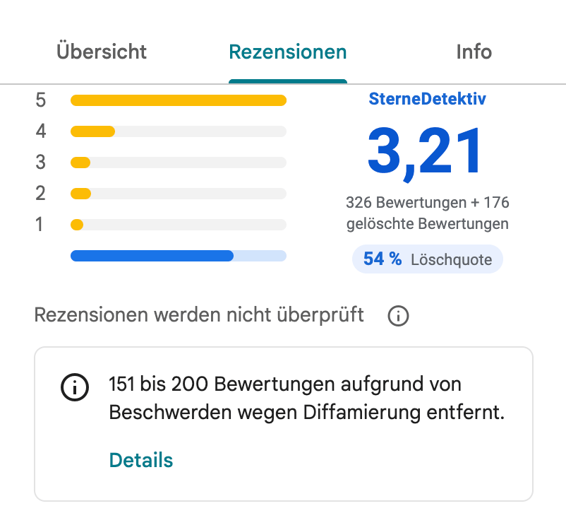
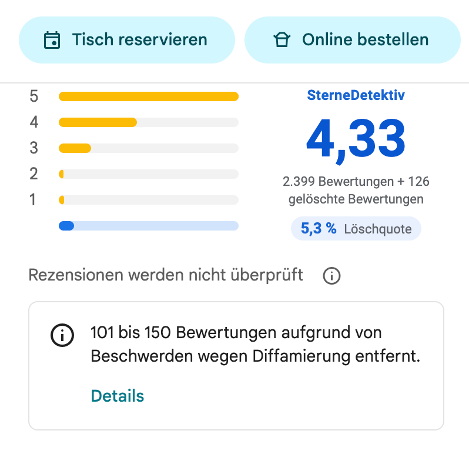
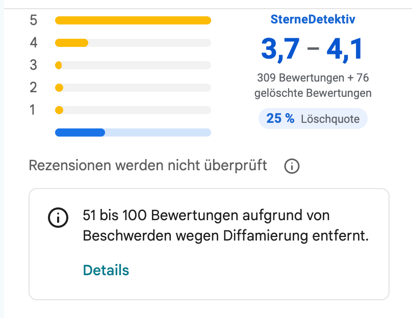
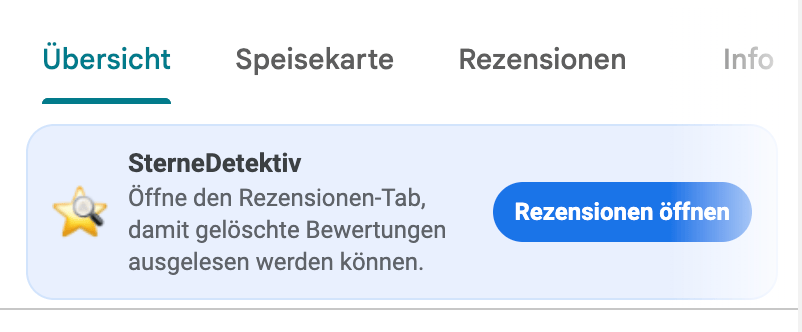

<p align="center">
  
</p>

<h1 align="center">SterneDetektiv</h1>

<p align="center">
  Browser-Erweiterung für Chrome/Chromium und Firefox, die gelöschte Google-Maps-Bewertungen sichtbar macht und in einen ehrlicheren Score einrechnet.
</p>

<p align="center">
  <a href="https://flxn.de/sternedetektiv">Website</a>
</p>

<p align="center">
  
</p>

## Was macht SterneDetektiv?

Der Score behandelt die von Google gemeldeten gelöschten Bewertungen als 1-Stern-Bewertungen:

```text
SterneDetektiv Score = (Anzahl Bewertungen * aktuelle Sterne + gelöschte Bewertungen) / (Anzahl Bewertungen + gelöschte Bewertungen)
```

Wenn Google eine Spanne meldet, z. B. `51 bis 100 Bewertungen ... entfernt`, nutzt die Erweiterung den Mittelwert dieser Spanne.

Zusätzlich wird unter dem 1-Stern-Balken ein blauer Balken für gelöschte Bewertungen angezeigt.

## Wie installiere ich die Erweiterung?

### Chrome / Chromium

1. Rechts in der Seitenleiste den aktuellen Release auswählen oder [DIESEN LINK klicken](https://github.com/flxn/sterne-detektiv/releases/latest)
2. Die `sternedetektiv-dist.zip`-Datei herunterladen und entpacken.
3. `chrome://extensions` öffnen. In Chromium-basierten Browsern ggf. die entsprechende Erweiterungsseite öffnen, z. B. `edge://extensions` oder `brave://extensions`.
4. Entwicklermodus aktivieren.
5. `Load unpacked` / `Entpackte Erweiterung laden` wählen.
6. Den entpackten Ordner auswählen.

### Firefox

1. Rechts in der Seitenleiste den aktuellen Release auswählen oder [DIESEN LINK klicken](https://github.com/flxn/sterne-detektiv/releases/latest)
2. Die `sternedetektiv-dist.zip`-Datei herunterladen und entpacken.
3. Firefox Extension Einstellungen öffnen, im Zahnrad oben rechts "Add-ons debuggen" auswählen. (Oder direkt diese URL eingeben: `about:debugging#/runtime/this-firefox`).
4. `Temporäres Add-on laden...` / `Load Temporary Add-on...` wählen.
5. Im entpackten Ordner die Datei `manifest.json` auswählen.

Hinweis: Temporäre Firefox-Add-ons werden beim Beenden von Firefox entfernt und müssen danach erneut geladen werden. Für eine dauerhafte Installation muss die Erweiterung zuerst als Firefox-Add-on signiert und veröffentlicht werden.

### Wieso so kompliziert?

Die Erweiterung ist aktuell nicht im Chrome Web Store oder auf addons.mozilla.org verfügbar und es ist unklar, ob die Veröffentlichung dort zugelassen wird. Falls die Erweiterung in einem Store landet, werde ich hier ein Update mit der neuen Installationsanleitung und Link zum Store veröffentlichen.

## Screenshots

| Mittelwert | Größerer Datensatz |
| --- | --- |
|  |  |

| Wertebereich | Hinweis im Übersichts-Tab |
| --- | --- |
|  |  |

## Build

```bash
npm install
npm run build
```

## Selektoren

Die aktuell ermittelten Google-Maps-Selektoren sind in `docs/google-maps-review-selectors.md` dokumentiert.

Die Extraktionslogik liegt in `src/reviewExtraction.ts`. Neue Sprachen oder geänderte Google-Maps-Strukturen sollten dort als neues `ReviewExtractionProfile` ergänzt werden, damit Rendering und DOM-Integration im Content Script getrennt bleiben.
